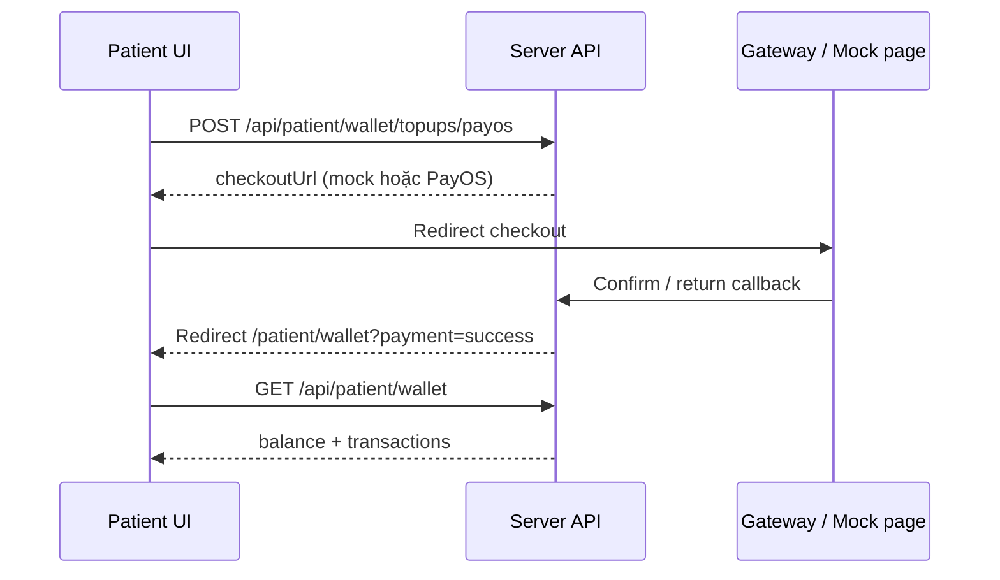

# OrcaXCare — Hướng dẫn test Payment (Wallet)

Tài liệu test **UI/UX thanh toán** cho bệnh nhân: nạp tiền ví qua **PayOS**, **VNPay**, **SePay**.

---

## 0. Phạm vi module Payment hiện tại

| Có trong app | Chưa có |
|--------------|---------|
| Ví bệnh nhân (balance) | Thanh toán đặt lịch khám trực tiếp trên UI |
| Nạp tiền (top-up) 3 cổng | Trừ tiền ví khi book appointment (API `deduct` có, UI chưa) |
| Lịch sử giao dịch | Hoàn tiền / refund UI |
| Checkout in-app + VietQR (PayOS) | Admin xem giao dịch toàn hệ thống |
| Polling trạng thái + PayOS webhook | |

**Luồng nghiệp vụ (hiện tại):**

```
Bệnh nhân nạp ví (PayOS / VNPay / SePay)
    → Số dư tăng
    → (sau này) Dùng số dư khi xác nhận đặt lịch khám
```

---

## 1. Chuẩn bị môi trường

### Chạy app

```bash
# Terminal 1
cd server && npm run dev

# Terminal 2
cd client && npm run dev
```

- Frontend: http://localhost:5173  
- Backend: http://localhost:5000  
- Đăng nhập: http://localhost:5173/login  

### Cấu hình `server/.env` (tham khảo)

| Biến | Ý nghĩa | Gợi ý test UI |
|------|---------|----------------|
| `PAYOS_MOCK=false` | PayOS **thật** — QR VietQR trong app | Mặc định khi đã có credentials |
| `PAYOS_MOCK=true` | Trang mock nội bộ (dev only) | Chỉ khi chưa có key PayOS |
| `VNPAY_MOCK=false` | VNPay sandbox thật | Trang checkout trong app → redirect VNPay |
| `SEPAY_MOCK=false` | SePay sandbox thật | Mở cổng SePay tab mới, poll IPN |
| `WALLET_MIN_TOPUP=10000` | Tối thiểu 10.000 ₫ | Test validation |
| `WALLET_MAX_TOPUP=50000000` | Tối đa 50.000.000 ₫ | |
| `API_PUBLIC_ORIGIN=http://localhost:5000` | Callback return/cancel | Bắt buộc khi test flow redirect |
| `CLIENT_ORIGIN=http://localhost:5173` | Redirect về client sau thanh toán | |

> **Thanh toán thật:** `PAYOS_MOCK=false`, `SEPAY_MOCK=false`, `VNPAY_MOCK=false`. PayOS hiển thị **mã QR VietQR** ngay trong app (`/patient/wallet/checkout/payos/{orderCode}`). Đăng ký webhook PayOS: `{API_PUBLIC_ORIGIN}/api/payments/payos/webhook`.

---

## 2. Tài khoản test

| Vai trò | Email | Mật khẩu |
|---------|-------|----------|
| **Patient** | `patient@orcaxcare.com` | `Patient@123` |

Chỉ **patient** mới vào được Wallet và thanh toán.

---

## 3. Đường dẫn UI (Patient)

| Màn hình | URL |
|----------|-----|
| Dashboard bệnh nhân | `/patient` |
| **Wallet (chính)** | `/patient/wallet` |
| **Checkout PayOS (QR thật)** | `/patient/wallet/checkout/payos/{orderCode}` |
| Checkout VNPay | `/patient/wallet/checkout/vnpay/{orderId}` |
| Checkout SePay | `/patient/wallet/checkout/sepay/{orderId}` |
| PayOS mock checkout (dev) | `/patient/wallet/payos/mock?orderCode=...` |
| VNPay mock checkout | `/patient/wallet/vnpay/mock?orderId=...` |
| SePay mock checkout | `/patient/wallet/sepay/mock?orderId=...` |

**Vào Wallet từ dashboard:** shortcut **Wallet** (badge Payments).

---

## 4. UI/UX cần quan sát trên Wallet

### 4.1 Trang Wallet (`/patient/wallet`)

| Khu vực | Mô tả UI | Ghi chú UX |
|---------|----------|------------|
| **Header** | Tiêu đề "Wallet", mô tả 3 cổng, nút Back to dashboard | |
| **Balance card** | Số dư VND lớn (`wallet-balance-card`) | Format tiền Việt |
| **Mock banner** | Dòng xám *"Payment sandbox mock mode is active…"* | Chỉ hiện khi có cổng đang mock |
| **Receipt card** | Reference, Provider, Amount, Status | Sau top-up thành công |
| **Form Top up** | Dropdown Payment method, input Amount, min/max | |
| **Nút Continue** | Đổi label theo cổng: PayOS / VNPay / SePay | Trạng thái "Redirecting…" khi submit |
| **Recent transactions** | List: loại, mô tả, số tiền, badge status | `success` xanh, `pending` vàng, `failed`/`cancelled` đỏ |

### 4.2 Trang Mock checkout (3 cổng — giao diện tương tự)

| Thành phần | UX |
|------------|-----|
| Tiêu đề | "PayOS / VNPay / SePay sandbox checkout" |
| Mô tả | "Mock payment page… No real charge" |
| Order code / order id | Hiển thị mã giao dịch |
| **Simulate successful payment** | Nạp thành công → về Wallet |
| **Cancel payment** | Hủy → alert đỏ trên Wallet |
| **Back to wallet** | Link secondary |

### 4.3 Sau khi quay về Wallet

| Query URL | UI |
|-----------|-----|
| `?payment=success&orderCode=...` | Alert xanh + receipt + balance cập nhật |
| `?payment=cancelled` | Alert đỏ, balance không đổi |
| `?payment=failed` | Alert đỏ |

---

## 5. Kịch bản test chi tiết

### TC-P01 — Xem Wallet lần đầu (empty state)

| Bước | Thao tác | Kết quả mong đợi |
|------|----------|------------------|
| 1 | Login `patient@orcaxcare.com` / `Patient@123` | Vào patient portal |
| 2 | Dashboard → **Wallet** | Mở `/patient/wallet` |
| 3 | Quan sát UI | Balance **0 ₫** (hoặc số cũ), form top-up hiện đủ |
| 4 | Recent transactions | "No transactions yet." |

**UI checklist:** Header, balance card, form, empty list — layout gọn, không lỗi loading.

---

### TC-P02 — PayOS top-up thành công (mock — khuyến nghị)

**Điều kiện:** `PAYOS_MOCK=true` trong `.env`, restart server.

| Bước | Thao tác | Kết quả mong đợi |
|------|----------|------------------|
| 1 | Wallet → Payment method: **PayOS** | |
| 2 | Amount: **100000** (100.000 ₫) | |
| 3 | **Continue to PayOS** | Chuyển sang `/patient/wallet/payos/mock?orderCode=...` |
| 4 | Quan sát mock page | Tiêu đề PayOS sandbox, có order code |
| 5 | **Simulate successful payment** | Về Wallet |
| 6 | Wallet | Alert xanh "Top-up successful…" |
| 7 | Balance | Tăng **100.000 ₫** |
| 8 | Receipt summary | Provider: payos, Status: success |
| 9 | Transactions | 1 dòng Top-up, badge **success** |

---

### TC-P03 — PayOS hủy thanh toán

| Bước | Thao tác | Kết quả mong đợi |
|------|----------|------------------|
| 1 | Top-up PayOS → mock page | |
| 2 | **Cancel payment** | Về Wallet |
| 3 | UI | Alert đỏ "Payment was cancelled…" |
| 4 | Balance | **Không đổi** |
| 5 | Transactions | Giao dịch **cancelled** (nếu có trong list) |

---

### TC-P04 — SePay top-up thành công (mock)

**Điều kiện:** `SEPAY_MOCK=true`

| Bước | Thao tác | Kết quả mong đợi |
|------|----------|------------------|
| 1 | Payment method: **SePay** | Nút đổi thành "Continue to SePay" |
| 2 | Amount: **200000** | |
| 3 | Continue | `/patient/wallet/sepay/mock?orderId=...` |
| 4 | Simulate success | Balance +200.000 ₫ |
| 5 | Receipt | Provider: sepay |

**So sánh UX:** Mock SePay giống PayOS — kiểm tra label nút và receipt đúng cổng.

---

### TC-P05 — VNPay

#### Nhánh A — Mock (`VNPAY_MOCK=true`) — test UI trong app

Giống TC-P02 nhưng chọn **VNPay** → `/patient/wallet/vnpay/mock?orderId=...`

#### Nhánh B — Sandbox thật (`VNPAY_MOCK=false`) — như `.env` hiện tại của bạn

| Bước | Thao tác | Kết quả mong đợi |
|------|----------|------------------|
| 1 | Chọn VNPay, Continue | **Redirect ra trang sandbox VNPay** (ngoài OrcaXCare) |
| 2 | Thanh toán trên sandbox | Quay về app qua return URL |
| 3 | Wallet | Balance cập nhật nếu thanh toán OK |

> Demo UI nội bộ: nên bật `VNPAY_MOCK=true` để không phụ thuộc cổng ngoài.

---

### TC-P06 — Validation số tiền

| Bước | Amount | Kết quả mong đợi |
|------|--------|------------------|
| 1 | **5000** (< min 10.000) | Lỗi khi submit (API 400) |
| 2 | **10000** | OK — min boundary |
| 3 | Để trống / 0 | HTML validation hoặc lỗi API |

---

### TC-P07 — Nhiều giao dịch (lịch sử)

| Bước | Thao tác | Kết quả mong đợi |
|------|----------|------------------|
| 1 | Top-up PayOS 100k — success | |
| 2 | Top-up SePay 50k — success | |
| 3 | Top-up PayOS — cancel | |
| 4 | Recent transactions | ≥3 dòng, sắp xếp mới nhất trước |
| 5 | Badge màu | success / cancelled phân biệt rõ |

---

### TC-P08 — Responsive & trạng thái nút

| Kiểm tra | Mong đợi |
|----------|----------|
| Submit top-up | Nút disabled + text "Redirecting…" |
| Mock confirm | "Processing…" khi đang gọi API |
| Mobile width | Balance card + form không vỡ layout |

---

## 6. Checklist demo UI/UX (tick khi test)

| # | Hạng mục | Pass? |
|---|----------|-------|
| 1 | Vào Wallet từ dashboard | ☐ |
| 2 | Balance hiển thị đúng format VND | ☐ |
| 3 | Mock mode banner (nếu bật mock) | ☐ |
| 4 | Dropdown 3 payment methods | ☐ |
| 5 | Min/max hint dưới ô amount | ☐ |
| 6 | PayOS mock → success → receipt | ☐ |
| 7 | PayOS mock → cancel → alert đỏ | ☐ |
| 8 | SePay mock → success | ☐ |
| 9 | VNPay (mock hoặc sandbox) | ☐ |
| 10 | Transaction list + status màu | ☐ |
| 11 | Back to dashboard | ☐ |
| 12 | Lỗi amount < 10.000 hiển thị rõ | ☐ |

---

## 7. Luồng kỹ thuật (để hiểu redirect)



**Mock mode:** bỏ qua cổng thật → trang mock trong app → `mock-confirm` API → cộng tiền.

---

## 8. Chưa test được trên UI (ghi nhận)

| Tính năng | Trạng thái |
|-----------|------------|
| Trừ ví khi đặt lịch | API có, chưa có màn booking |
| Thanh toán trực tiếp không qua ví | Chưa có |
| Admin dashboard giao dịch | Chưa có |
| Email biên lai | Chưa có |

---

## 9. Xử lý sự cố

| Triệu chứng | Cách xử lý |
|-------------|------------|
| Wallet loading mãi | Server chưa chạy / chưa login patient |
| Continue không chuyển trang | Xem Network tab; kiểm tra API topup 201 |
| Mock page "Missing order code" | URL thiếu query — tạo top-up lại từ Wallet |
| Success nhưng balance không đổi | Refresh; kiểm tra transaction status trong DB |
| VNPay redirect lỗi | Cần `API_PUBLIC_ORIGIN`; hoặc bật `VNPAY_MOCK=true` |
| Không thấy mock banner | Cả 3 cổng đều `*_MOCK=false` và có credential thật |

---

## 10. API tham khảo (debug)

| Method | Endpoint | Auth |
|--------|----------|------|
| GET | `/api/patient/wallet` | Patient |
| POST | `/api/patient/wallet/topups/payos` | Patient |
| POST | `/api/patient/wallet/topups/vnpay` | Patient |
| POST | `/api/patient/wallet/topups/sepay` | Patient |
| POST | `/api/patient/wallet/payos/mock-confirm` | Patient (mock) |
| POST | `/api/patient/wallet/vnpay/mock-confirm` | Patient (mock) |
| POST | `/api/patient/wallet/sepay/mock-confirm` | Patient (mock) |
| GET | `/api/patient/wallet/receipts/:ref` | Patient |

---

## 11. Gợi ý thứ tự demo nhanh (5 phút)

1. Login patient → **Wallet**  
2. PayOS 100k → **Simulate success** → chụp receipt + balance  
3. SePay 50k → success → xem transaction list  
4. PayOS → **Cancel** → chụp alert đỏ  
5. (Tùy chọn) Đổi `VNPAY_MOCK=true`, test VNPay mock cho đủ 3 cổng cùng UI

---

*Tài liệu cập nhật theo module Wallet — PayOS / VNPay / SePay (OrcaXCare).*
