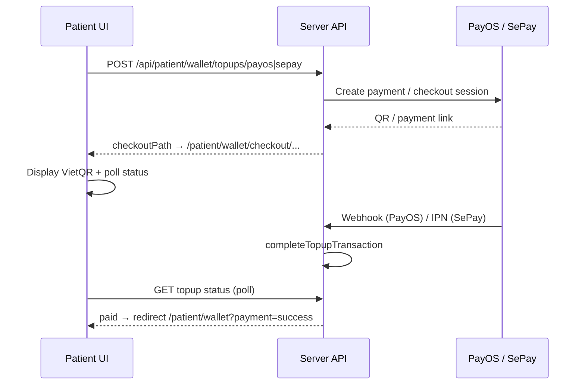

# OrcaXCare — Hướng dẫn test Payment (Wallet)

Tài liệu test **UI/UX thanh toán thật** cho bệnh nhân: nạp tiền ví qua **PayOS** và **SePay** (sandbox/production API — **không dùng mock nội bộ**).

---

## ⚠ Quy tắc WDP301 — mọi thứ phải REAL

| Yêu cầu | Chi tiết |
|---------|----------|
| **Không mock UI** | Không dùng `/patient/wallet/*/mock`, không bật `*_MOCK=true` khi demo / báo cáo |
| **Cổng thật** | PayOS VietQR + SePay checkout qua API sandbox/production |
| **`.env` bắt buộc** | `PAYOS_MOCK=false`, `SEPAY_MOCK=false` + đủ credentials từ dashboard PayOS / SePay |
| **Webhook / IPN** | PayOS webhook + SePay IPN trỏ về `{API_PUBLIC_ORIGIN}/api/payments/...` (local: dùng ngrok nếu cần) |
| **Hủy thanh toán** | Qua nút **Cancel** trên giao dịch `pending` hoặc cancel URL của cổng — **không** simulate trên trang mock |

> Mock mode (`PAYOS_MOCK`, `SEPAY_MOCK`, `mock-confirm` API) chỉ phục vụ **unit test tự động** trong repo — **không** dùng cho demo WDP301.

---

## 0. Phạm vi module Payment hiện tại

| Có trong app | Chưa có |
|--------------|---------|
| Ví bệnh nhân (balance) | Thanh toán đặt lịch khám trực tiếp trên UI |
| Nạp tiền (top-up) PayOS + SePay | Trừ tiền ví khi book appointment (API `deduct` có, UI chưa) |
| Lịch sử giao dịch | Hoàn tiền / refund UI |
| Checkout in-app + VietQR (PayOS, SePay) | Admin xem giao dịch toàn hệ thống |
| Polling trạng thái + PayOS webhook + SePay IPN | |

**Luồng nghiệp vụ (hiện tại):**

```
Bệnh nhân nạp ví (PayOS / SePay — cổng thật)
    → Số dư tăng (webhook/IPN hoặc polling xác nhận)
    → (sau này) Dùng số dư khi xác nhận đặt lịch khám
```

---

## 1. Chuẩn bị môi trường

### Chạy app

```bash
# Terminal 1
cd server && npm run dev

# Terminal 2
cd client && npm run dev
```

- Frontend: http://localhost:5173  
- Backend: http://localhost:5000  
- Đăng nhập: http://localhost:5173/login  

### Cấu hình `server/.env` (bắt buộc cho test thật)

| Biến | Giá trị demo WDP301 | Ghi chú |
|------|---------------------|---------|
| `PAYOS_MOCK` | **`false`** | Bắt buộc |
| `SEPAY_MOCK` | **`false`** | Bắt buộc |
| `PAYOS_CLIENT_ID`, `PAYOS_API_KEY`, `PAYOS_CHECKSUM_KEY` | Từ https://my.payos.vn/ | Channel credentials |
| `SEPAY_MERCHANT_ID`, `SEPAY_SECRET_KEY` | Từ https://my.sepay.vn/ | Sandbox: `SP-TEST-...` |
| `WALLET_MIN_TOPUP=10000` | Tối thiểu 10.000 ₫ | Test validation |
| `WALLET_MAX_TOPUP=50000000` | Tối đa 50.000.000 ₫ | |
| `API_PUBLIC_ORIGIN` | `http://localhost:5000` hoặc ngrok HTTPS | Callback return/cancel + webhook |
| `CLIENT_ORIGIN=http://localhost:5173` | Redirect về client sau thanh toán | |

**Đăng ký URL trên dashboard cổng:**

| Cổng | URL |
|------|-----|
| PayOS webhook | `{API_PUBLIC_ORIGIN}/api/payments/payos/webhook` |
| SePay IPN | `{API_PUBLIC_ORIGIN}/api/payments/sepay/ipn` |

Sau khi sửa `.env`: **restart server**.

---

## 2. Tài khoản test

| Vai trò | Email | Mật khẩu |
|---------|-------|----------|
| **Patient** | `patient@orcaxcare.com` | `Patient@123` |

Chỉ **patient** mới vào được Wallet và thanh toán.

---

## 3. Đường dẫn UI (Patient — real checkout)

| Màn hình | URL |
|----------|-----|
| Dashboard bệnh nhân | `/patient` |
| **Wallet (chính)** | `/patient/wallet` |
| **Checkout PayOS (QR VietQR thật)** | `/patient/wallet/checkout/payos/{orderCode}` |
| **Checkout SePay (QR / chuyển khoản thật)** | `/patient/wallet/checkout/sepay/{orderId}` |

**Vào Wallet từ dashboard:** shortcut **Wallet** (badge Payments).

---

## 4. UI/UX cần quan sát trên Wallet

### 4.1 Trang Wallet (`/patient/wallet`)

| Khu vực | Mô tả UI | Ghi chú UX |
|---------|----------|------------|
| **Header** | Tiêu đề "Wallet", mô tả PayOS + SePay, nút Back to dashboard | |
| **Balance card** | Số dư VND lớn | Format tiền Việt |
| **Receipt card** | Reference, Provider, Amount, Status | Sau top-up thành công |
| **Form Top up** | Dropdown Payment method (PayOS / SePay), input Amount | |
| **Nút Continue** | "Continue — scan QR" (PayOS) / "Continue with SePay" | Trạng thái "Redirecting…" khi submit |
| **Recent transactions** | List + badge status | `success` xanh, `pending` vàng, `failed`/`cancelled` đỏ |
| **Pending actions** | **Resume payment** + **Cancel** | Chỉ giao dịch `pending` |

### 4.2 Trang Checkout thật (`/patient/wallet/checkout/...`)

| Thành phần | UX |
|------------|-----|
| Hero | "Complete top-up" — mô tả quét QR / cổng thật |
| QR VietQR | PayOS hoặc SePay — quét bằng app ngân hàng |
| Polling | Trang tự poll mỗi 3s; thành công → redirect Wallet + alert xanh |
| **Back to wallet** | Quay về Wallet — giao dịch vẫn **pending** cho đến khi hủy hoặc thanh toán |
| PayOS | Có thêm link **Open PayOS page** (trang cổng PayOS) |

### 4.3 Sau khi quay về Wallet

| Query URL | UI |
|-----------|-----|
| `?payment=success&orderCode=...` | Alert xanh + receipt + balance cập nhật |
| `?payment=cancelled` | Alert đỏ, balance **không đổi** |
| `?payment=failed` | Alert đỏ |

---

## 5. Kịch bản test chi tiết (REAL only)

### TC-P01 — Xem Wallet lần đầu

| Bước | Thao tác | Kết quả mong đợi |
|------|----------|------------------|
| 1 | Login `patient@orcaxcare.com` / `Patient@123` | Vào patient portal |
| 2 | Dashboard → **Wallet** | Mở `/patient/wallet` |
| 3 | Quan sát UI | Balance hiện đúng, form top-up có PayOS + SePay |
| 4 | Recent transactions | "No transactions yet." (nếu chưa có lịch sử) |

---

### TC-P02 — PayOS top-up thành công (REAL)

**Điều kiện:** `PAYOS_MOCK=false`, credentials PayOS hợp lệ, server đã restart.

| Bước | Thao tác | Kết quả mong đợi |
|------|----------|------------------|
| 1 | Wallet → Payment method: **PayOS** | |
| 2 | Amount: **100000** (100.000 ₫) | |
| 3 | **Continue — scan QR** | Chuyển `/patient/wallet/checkout/payos/{orderCode}` |
| 4 | Quan sát checkout | QR VietQR thật, có amount, polling "pending" |
| 5 | Quét QR bằng app ngân hàng **hoặc** mở **Open PayOS page** và thanh toán sandbox PayOS | |
| 6 | Chờ webhook/polling | Tự redirect về Wallet, alert xanh |
| 7 | Balance | Tăng **100.000 ₫** |
| 8 | Transactions | 1 dòng Top-up, badge **success** |

---

### TC-P03 — PayOS hủy thanh toán (REAL)

**Cách 1 — Hủy trong app (khuyến nghị demo):**

| Bước | Thao tác | Kết quả mong đợi |
|------|----------|------------------|
| 1 | Top-up PayOS → checkout page | Giao dịch `pending` |
| 2 | **Back to wallet** (không quét QR) | Về Wallet, giao dịch vẫn **pending** |
| 3 | Trong Recent transactions → **Cancel** | Gọi `POST /api/patient/wallet/topups/payos/{orderCode}/cancel` |
| 4 | UI | Giao dịch chuyển **cancelled**, balance **không đổi** |

**Cách 2 — Hủy trên cổng PayOS:**

| Bước | Thao tác | Kết quả mong đợi |
|------|----------|------------------|
| 1 | **Open PayOS page** trên checkout | Trang PayOS thật |
| 2 | Chọn hủy / thoát theo UI PayOS | PayOS gọi `cancelUrl` → server `markTopupCancelled` |
| 3 | Redirect | `/patient/wallet?payment=cancelled` — alert đỏ |

> **Lưu ý:** Chỉ bấm "Back to wallet" **không** hủy giao dịch — phải dùng **Cancel** hoặc hủy trên cổng.

---

### TC-P04 — SePay top-up thành công (REAL)

**Điều kiện:** `SEPAY_MOCK=false`, `SEPAY_MERCHANT_ID` + `SEPAY_SECRET_KEY` sandbox.

| Bước | Thao tác | Kết quả mong đợi |
|------|----------|------------------|
| 1 | Payment method: **SePay** | Nút "Continue with SePay" |
| 2 | Amount: **200000** | |
| 3 | Continue | `/patient/wallet/checkout/sepay/{orderId}` |
| 4 | Quan sát | QR VietQR + chi tiết chuyển khoản (STK, nội dung CK) |
| 5 | Chuyển khoản đúng số tiền + memo theo SePay sandbox | SePay IPN → server cộng ví |
| 6 | Polling / redirect | Balance +200.000 ₫, status **success** |

---

### TC-P05 — SePay hủy thanh toán (REAL)

| Bước | Thao tác | Kết quả mong đợi |
|------|----------|------------------|
| 1 | Tạo top-up SePay, không chuyển khoản | Giao dịch **pending** |
| 2 | Wallet → **Cancel** trên dòng pending | Status **cancelled**, balance không đổi |

*(SePay cancel URL: `{API_PUBLIC_ORIGIN}/api/payments/sepay/cancel?orderId=...` — khi user hủy trên flow redirect nếu có.)*

---

### TC-P06 — Validation số tiền

| Bước | Amount | Kết quả mong đợi |
|------|--------|------------------|
| 1 | **5000** (< min 10.000) | Lỗi khi submit (API 400) |
| 2 | **10000** | OK — min boundary |
| 3 | Để trống / 0 | HTML validation hoặc lỗi API |

---

### TC-P07 — Nhiều giao dịch (lịch sử)

| Bước | Thao tác | Kết quả mong đợi |
|------|----------|------------------|
| 1 | Top-up PayOS 100k — success (REAL) | |
| 2 | Top-up SePay 50k — success (REAL) | |
| 3 | Top-up PayOS — **Cancel** pending | |
| 4 | Recent transactions | ≥3 dòng, mới nhất trước |
| 5 | Badge màu | success / cancelled / pending phân biệt rõ |

---

### TC-P08 — Responsive & trạng thái nút

| Kiểm tra | Mong đợi |
|----------|----------|
| Submit top-up | Nút disabled + text "Redirecting…" |
| Checkout polling | Thông báo pending → success/failed/cancelled |
| Mobile width | QR + form không vỡ layout |

---

## 6. Checklist demo WDP301 (REAL — tick khi test)

| # | Hạng mục | Pass? |
|---|----------|-------|
| 1 | `.env`: `PAYOS_MOCK=false`, `SEPAY_MOCK=false` | ☐ |
| 2 | Vào Wallet từ dashboard | ☐ |
| 3 | Balance hiển thị đúng format VND | ☐ |
| 4 | Dropdown PayOS + SePay (không mock page) | ☐ |
| 5 | Min/max hint dưới ô amount | ☐ |
| 6 | PayOS REAL → QR → success → receipt | ☐ |
| 7 | PayOS pending → **Cancel** → cancelled | ☐ |
| 8 | SePay REAL → QR/CK → success | ☐ |
| 9 | Transaction list + status màu | ☐ |
| 10 | Back to dashboard | ☐ |
| 11 | Lỗi amount < 10.000 hiển thị rõ | ☐ |

---

## 7. Luồng kỹ thuật (REAL)



**Hủy (REAL):**

```
Patient → Cancel (Wallet list)
  → POST .../topups/{provider}/{ref}/cancel
  → markTopupCancelled → status cancelled, balance unchanged

PayOS cancel URL → GET /api/payments/payos/cancel → markTopupCancelled
SePay cancel URL → GET /api/payments/sepay/cancel → markTopupCancelled
```

---

## 8. Chưa test được trên UI (ghi nhận)

| Tính năng | Trạng thái |
|-----------|------------|
| Trừ ví khi đặt lịch | API có, chưa có màn booking |
| Thanh toán trực tiếp không qua ví | Chưa có |
| Admin dashboard giao dịch | Chưa có |
| Email biên lai | Chưa có |

---

## 9. Xử lý sự cố

| Triệu chứng | Cách xử lý |
|-------------|------------|
| Wallet loading mãi | Server chưa chạy / chưa login patient |
| Continue không chuyển trang | Network tab; API topup phải 201 |
| Checkout "Could not load" | Kiểm tra credentials PayOS/SePay; restart server |
| Quét QR xong balance không đổi | Webhook/IPN chưa tới server — dùng ngrok cho `API_PUBLIC_ORIGIN` |
| Giao dịch kẹt **pending** | Dùng **Cancel** trên Wallet hoặc hủy trên cổng |
| Redirect lỗi sau PayOS/SePay | `API_PUBLIC_ORIGIN` + `CLIENT_ORIGIN` đúng trong `.env` |
| Thấy URL `/mock` | Sai cấu hình — đặt `*_MOCK=false` và restart |

---

## 10. API tham khảo (debug — REAL)

| Method | Endpoint | Auth |
|--------|----------|------|
| GET | `/api/patient/wallet` | Patient |
| POST | `/api/patient/wallet/topups/payos` | Patient |
| POST | `/api/patient/wallet/topups/sepay` | Patient |
| POST | `/api/patient/wallet/topups/payos/:orderCode/cancel` | Patient |
| POST | `/api/patient/wallet/topups/sepay/:ref/cancel` | Patient |
| GET | `/api/patient/wallet/topups/:provider/:ref/checkout` | Patient |
| GET | `/api/patient/wallet/topups/:provider/:ref/status` | Patient |
| GET | `/api/patient/wallet/receipts/:ref` | Patient |
| POST | `/api/payments/payos/webhook` | PayOS |
| GET | `/api/payments/payos/cancel` | PayOS redirect |
| POST | `/api/payments/sepay/ipn` | SePay |
| GET | `/api/payments/sepay/cancel` | SePay redirect |

*(Các endpoint `mock-confirm` chỉ dùng cho automated tests — không dùng demo WDP301.)*

---

## 11. Gợi ý thứ tự demo nhanh (REAL — ~10 phút)

1. Xác nhận `.env`: `PAYOS_MOCK=false`, `SEPAY_MOCK=false` → restart server  
2. Login patient → **Wallet**  
3. PayOS 100k → checkout QR → thanh toán sandbox → chụp receipt + balance  
4. SePay 50k → quét QR / CK sandbox → xem transaction list  
5. PayOS mới → **Back to wallet** → **Cancel** pending → chụp status **cancelled**

---

*Tài liệu cập nhật theo module Wallet — PayOS / SePay REAL (OrcaXCare, WDP301).*
