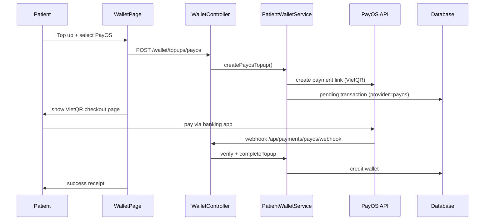
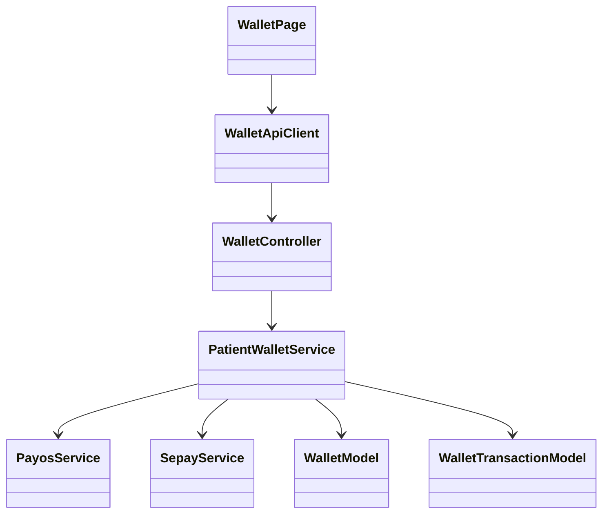

# WDP301 — Diagram & Figure Corrections (MoMo → SePay)

**Source (do not edit in place):** `docs/WDP301-SE1816-GROUP4_Document.docx`  
**Scope:** Chỉ các **hình vẽ / diagram** còn nhắc MoMo. Copy nội dung dưới đây khi vẽ lại hoặc sửa ảnh trong Word.

**Chuẩn hệ thống:** PayOS + SePay (không MoMo, không VNPay trên UI patient).

---

## 1. Danh sách Figure cần sửa hình

| Figure | Tên | Việc cần làm |
|--------|-----|----------------|
| **Figure 2** | Use case diagram — Patient | Đổi UC-7.2 **Pay via Momo** → **Pay via SePay** |
| **Figure 10** | ERD | Enum `method`: `payos, sepay, wallet` (bỏ `momo`) |
| **Figure 19** | UI Design — Book Appointment | Popup payment: **PayOS / SePay / Wallet** (bỏ Momo) |
| **Figure 24** | UI Design — My Wallet | Gateway picker: **PayOS + SePay**; có thể thêm màn checkout VietQR |
| **Figure 12 / 47** | Code Package Diagram | Package/service **Momo** → **SePay** (`sepay.service.js`, `payos.service.js`) |
| **Figure 61** | Class Diagram — UC-7 Book Appointment | Actor/lifeline **Momo** → **SePay**; enum payment method |
| **Figure 62** | Sequence Diagram — UC-7 Book Appointment | Participant **Momo** → **SePay** |
| **Figure 71** | Class Diagram — UC-12 View Wallet Balance | **MomoService / MomoGateway** → **SepayService** (+ PayosService nếu có) |
| **Figure 72** | Sequence Diagram — UC-12 View Wallet Balance | Luồng top-up: in-app VietQR + webhook/IPN (không redirect Momo) |

> Nếu use case diagram **Guest/Admin** có nhãn payment gateway Momo ở chú thích — đổi tương tự.

---

## 2. Thay nhãn nhanh trên mọi diagram

| Trên hình (Before) | Trên hình (After) |
|--------------------|-------------------|
| `Momo` | `SePay` |
| `MoMo` | `SePay` |
| `MomoGateway` | `SePay Gateway` |
| `MomoService` | `SepayService` |
| `Pay via Momo` | `Pay via SePay` |
| `UC-7.2 Pay via Momo` | `UC-7.2 Pay via SePay` |
| `PayOS / Momo` | `PayOS / SePay` |
| `PayOS, Momo` | `PayOS, SePay` |
| `Wallet / PayOS / Momo` | `Wallet / PayOS / SePay` |
| `Enum(payos, momo, wallet)` | `Enum(payos, sepay, wallet)` |
| `provider: momo` | `provider: sepay` |
| `POST .../topups/momo` | `POST .../topups/sepay` |
| `Momo callback` | `SePay IPN` |
| `Redirect to Momo` | `Open checkout page (VietQR)` |

---

## 3. Figure 2 — Patient Use Case Diagram

**Sửa:**
- UC con dưới **Book Appointment (UC-7)**:
  - UC-7.1 Pay via PayOS — giữ nguyên
  - UC-7.2 **Pay via SePay** (đổi từ Momo)
  - UC-7.3 Apply Insurance Discount — giữ nguyên
- Mũi tên actor phụ (external system): **PayOS**, **SePay** (không Momo)

---

## 4. Figure 10 — ERD

**Entity `payments` / `wallet_transactions` (nếu có):**

```
method: Enum(payos, sepay, wallet)
provider: String   // "payos" | "sepay"
```

Bỏ mọi giá trị `momo` trong chú thích enum trên sơ đồ.

---

## 5. Figure 19 — UI Book Appointment (payment popup)

**Trên mockup:**
- Radio / button payment method:
  - Medical Wallet
  - **PayOS**
  - **SePay**
- Bỏ logo/nhãn Momo

---

## 6. Figure 24 — UI My Wallet

**Trang `/patient/wallet`:**
- Section **Top up**: 2 thẻ chọn cổng — **PayOS**, **SePay**
- Min amount label: **10,000 VND** (khớp `WALLET_MIN_TOPUP`)

**Optional — thêm inset nhỏ (checkout):**
- Route PayOS: `/patient/wallet/checkout/payos/{orderCode}` — màn hình **VietQR**
- Route SePay: `/patient/wallet/checkout/sepay/{orderId}` — màn hình **VietQR**

---

## 7. Figure 12 / 47 — Code Package Diagram

**Backend package `services` (khớp repo thật):**

| Before (cũ) | After (đúng code) |
|-------------|-------------------|
| `momo.service.js` | `sepay.service.js` |
| (nếu thiếu) | `payos.service.js` |
| `patientWallet.service.js` | giữ — orchestrates PayOS + SePay |

**Controllers / routes (nếu vẽ chi tiết):**
- `payosPayment.controller.js` — webhook/return
- `sepayPayment.controller.js` — IPN/return
- `patient.routes.js` — `/wallet/topups/payos`, `/wallet/topups/sepay`

---

## 8. Figure 61 — Class Diagram UC-7 (Book Appointment)

**Classes (giữ cấu trúc cũ, đổi tên gateway):**

```
BookAppointmentPage
AppointmentApiClient
AppointmentController
AppointmentService
PaymentModel          // method: payos | sepay | wallet
WalletModel
WalletService
```

**External actors / boundary:**
- `<<external>> PayOS`
- `<<external>> SePay`   ← thay Momo

**Quan hệ gợi ý:**
- `AppointmentService` → uses → `WalletService`
- `AppointmentService` → uses → `PayosService` / `SepayService` (hoặc gọi chung qua payment adapter)

---

## 9. Figure 62 — Sequence Diagram UC-7 (Book Appointment)

**Participants:**

```
Patient | BookAppointmentPage | AppointmentController | AppointmentService | WalletService | PayOS | SePay | Database
```

**Bước 6–8 (payment branch) — After:**

```
Patient -> BookAppointmentPage: choose payment (Wallet / PayOS / SePay)
alt Pay via Wallet (UC-7.x)
  AppointmentService -> WalletService: deductBalance(patientId, fee)
else Pay via PayOS (UC-7.1)
  AppointmentService -> PayOS: create payment / verify
else Pay via SePay (UC-7.2)
  AppointmentService -> SePay: create checkout / verify IPN
end
AppointmentService -> Database: confirm appointment + record payment
AppointmentService -> Patient: booking confirmation
```

Bỏ mọi message `redirect to Momo`, `Momo return URL`.

---

## 10. Figure 71 — Class Diagram UC-12 (View Wallet Balance)

**Khớp document text + codebase:**

```
WalletPage
WalletApiClient
WalletController
PatientWalletService    // hoặc WalletService
WalletTransactionModel
WalletModel (Mongoose)
PayosService            <<external integration>>
SepayService            <<external integration>>
```

**Bỏ:** `MomoService`, `MomoGateway`, `MomoController`

**WalletPage methods (gợi ý trên diagram):**
- `getWallet()`
- `createTopup(provider: payos | sepay, amount)`
- `pollTopupStatus(provider, ref)`

---

## 11. Figure 72 — Sequence Diagram UC-12 (Top-up) — quan trọng nhất

Đây là diagram hay sai nhất (luồng cũ: redirect Momo). **Vẽ lại theo app hiện tại:**

### Participants

```
Patient | WalletPage | WalletController | PatientWalletService | PayosService/SePayService | PayOS API | SePay API | Database
```

### Normal flow — PayOS branch

```
1. Patient -> WalletPage: open My Wallet
2. WalletPage -> WalletController: GET /api/patient/wallet
3. WalletController -> Database: load balance + transactions
4. Patient -> WalletPage: Top Up, amount, select PayOS
5. WalletPage -> WalletController: POST /api/patient/wallet/topups/payos
6. WalletController -> PatientWalletService: createPayosTopup()
7. PatientWalletService -> PayosService: createPayosPaymentLink()
8. PayosService -> PayOS API: create payment link + VietQR
9. PatientWalletService -> Database: insert pending WalletTransaction (provider=payos)
10. WalletPage -> Patient: show checkout page with VietQR (/patient/wallet/checkout/payos/{orderCode})
11. Patient -> PayOS API: scan QR & pay (banking app)
12. PayOS API -> WalletController: POST /api/payments/payos/webhook
13. WalletController -> PatientWalletService: verify + completeTopup
14. PatientWalletService -> Database: credit wallet, mark transaction success
15. WalletPage -> Patient: receipt + updated balance (polling status)
```

### Normal flow — SePay branch (bước 4–15 tương tự)

```
5. POST /api/patient/wallet/topups/sepay
7. PatientWalletService -> SepayService: initializeSepayCheckout()
8. SepayService -> SePay API: POST checkout/init → parse VietQR URL
10. Checkout page /patient/wallet/checkout/sepay/{orderId}
12. SePay API -> WalletController: POST /api/payments/sepay/ipn
   (hoặc polling GET .../status while page open)
```

**Không vẽ:** redirect sang `momo.vn`, iframe Momo, hay tab Momo.

---

## 12. Mermaid mẫu (copy sang draw.io / PlantUML / StarUML)

### UC-12 Sequence (PayOS top-up)



### UC-12 Class (rút gọn)



---

## 13. Checklist hình vẽ trước khi export PDF

- [ ] Ctrl+F trong file Word: **không còn `Momo` trong text** (kể cả text box trên ảnh — phải sửa trực tiếp trên hình)
- [ ] Figure 2: UC-7.2 = **Pay via SePay**
- [ ] Figure 10 ERD: enum không còn `momo`
- [ ] Figure 19 & 24: UI chỉ **PayOS + SePay**
- [ ] Figure 61–62: participant **SePay**, không Momo
- [ ] Figure 71–72: **SepayService** + luồng **VietQR in-app**
- [ ] Export lại PDF sau khi thay ảnh

---

*OrcaXCare — payment providers: PayOS + SePay. Align diagrams with `payos.service.js`, `sepay.service.js`, `patientWallet.service.js`.*
