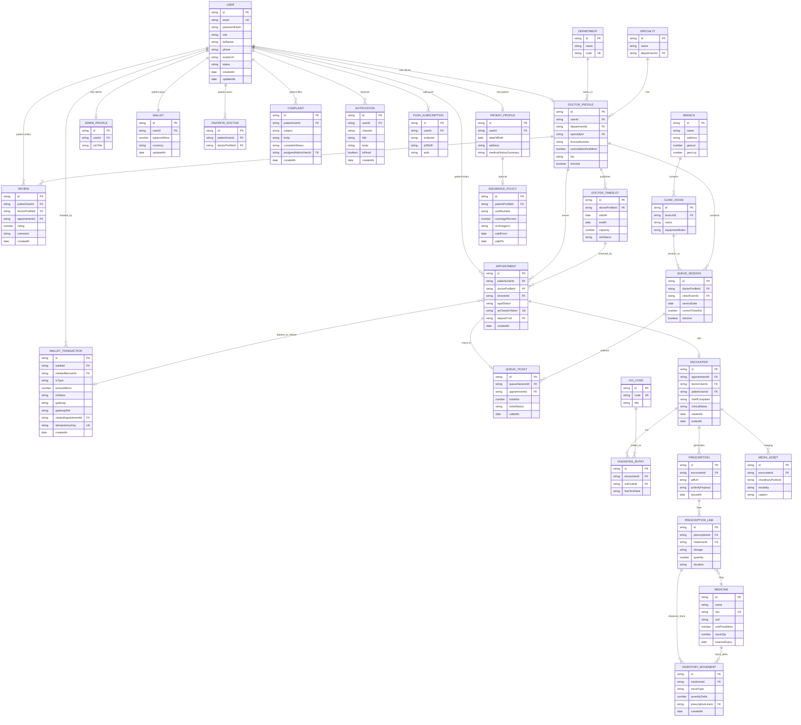

# OrcaXCare — Database diagram (ERD)

This document describes the **logical data model** (ERD) for **Healthcare administration & patient portal** (MERN + MongoDB Atlas). Use it to lock the schema before implementing APIs (following team dependency order).

**Conventions:** `PK` = primary key (`_id` as ObjectId), `FK` = reference `ObjectId` to another collection. Store money as the **smallest currency integer unit** (e.g. VND ×1) in code + validation; avoid `float`.

---

## 1. Full ER diagram (Mermaid)

> Render in VS Code / GitHub / Notion with Mermaid. Export PNG: [mermaid.live](https://mermaid.live) or import into draw.io.
>
> **Mermaid note:** Inside entity bodies **do not** use attribute names starting with `_` (e.g. `_id`) — the parser raises `BLOCK_STOP`. Use `id` to mean MongoDB `_id`; reference fields use type `string` (ObjectId in the app).

**`INVENTORY_MOVEMENT` note:** The `dispense_trace` edge is stock-out tied to a **prescription line** (traceable to `ENCOUNTER` → patient). **Inbound / adjustment** movements not tied to a prescription leave `prescriptionLineId` **null** — the ERD is still valid; there is simply no edge to a specific line.

---

## 2. Grouping by domain (for parallel work)

| Area | Collections / focus | Notes |
|------|----------------------|--------|
| **Identity & RBAC** | `users`, `patient_profiles`, `doctor_profiles`, `admin_profiles` | JWT carries `userId` + `role`; RBAC in middleware + resource ownership checks. |
| **Catalog & CMS** | `departments`, `specialties`, `branches`, `clinic_rooms`, `icd_codes`, `medicines` | Admin/doctor CMS; `medicines` links stock + expiry warnings (field or separate batch collection later). |
| **Scheduling** | `doctor_timeslots`, `appointments` | Prevent double booking: partial unique index on `(doctorProfileId, startAt)` or enforce max N `appointments` per slot via `capacity`. |
| **Real-time queue** | `queue_sessions`, `queue_tickets` | Socket.io **pushes events**; the database remains the source of truth. |
| **Finance** | `wallets`, `wallet_transactions` | Credits/debits inside a **MongoDB transaction** or outbox pattern; `idempotencyKey` prevents double payment. |
| **Insurance** | `insurance_policies` | OCR stores image URL + parsed fields; apply discounts in the service layer when creating `wallet_transactions`. |
| **Visit & EMR** | `encounters`, `diagnosis_entries`, `media_assets` | Timeline = sort `encounters` by `startedAt`. |
| **Prescribing & stock** | `prescriptions`, `prescription_lines`, `inventory_movements` | Deduct stock when finalizing a prescription; `inventory_movements` is the audit trail. |
| **Portal & engagement** | `reviews`, `favorite_doctors`, `complaints`, `notifications`, `push_subscriptions` | Web Push stores subscription per user. |

---

## 3. Suggested indexes (minimum)

- `users.email` **unique**
- `appointments`: `(doctorProfileId, timeslotId)` **unique** (if one slot = one patient), or a compound index per your slot rules
- `wallet_transactions.idempotencyKey` **unique sparse**
- `queue_tickets`: `(queueSessionId, ticketNo)` **unique**
- `favorite_doctors`: `(patientUserId, doctorProfileId)` **unique**
- `reviews`: `appointmentId` **unique** (one review per appointment)

---

## 4. Team decisions to lock **before** bulk coding

1. **User vs profile:** separate `users` + role-specific profiles (as in the diagram) vs single document — the diagram assumes split profiles for clearer forms and indexes.
2. **Visit slots:** are `doctor_timeslots` system-generated (shifts) or doctor-created — affects scheduling features (e.g. backlog items 2, 20).
3. **Wallet scope:** wallet only for `role=patient` or also internal staff wallets — affects unique `wallet.userId`.
4. **Prescription PDF / QR:** store `pdfUrl` + `qrVerifyPayload` vs hash-only — affects the `prescriptions` collection shape.

---

## 5. Revision history

| Version | Date | Description |
|---------|------|-------------|
| 0.2 | 2026-05-14 | Mermaid erDiagram syntax fixes (`id` instead of `_id`, string fields instead of quoted enums, `isRead` instead of `read`). |
| 0.1 | 2026-05-14 | Initial OrcaXCare ERD draft (WDP301). |
| 0.3 | 2026-05-14 | Documentation translated to English. |
